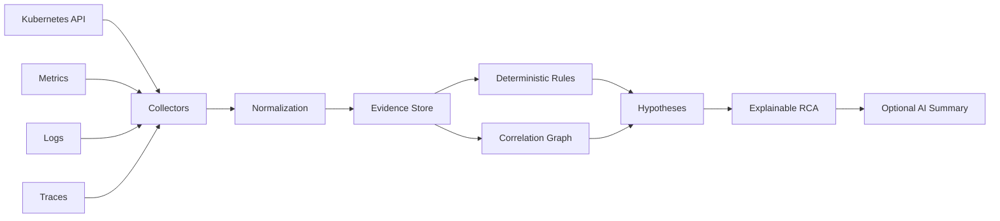

# Kubernetes RCA Engine

Evidence-driven **Root Cause Analysis for Kubernetes incidents**.

The project follows one principle: **collect deterministic evidence first, infer second**. AI may summarize or rank hypotheses, but the diagnostic record remains inspectable by an engineer.

## Current v0.1

The first implementation contains a deterministic rules engine that analyzes normalized incident JSON and recognizes:

- pod eviction caused by ephemeral-storage pressure;
- OOMKilled containers;
- CrashLoopBackOff symptoms.

## Quick start

```bash
go test ./...
go run ./cmd/krca analyze examples/evicted-ephemeral-storage.json
```

## Architecture



See [docs/architecture.md](docs/architecture.md).

## Design principles

- **Evidence first** — every finding points to observable signals.
- **Explainability** — confidence never replaces evidence.
- **Symptom vs. cause** — CrashLoopBackOff is a state, not automatically a root cause.
- **Read-only by default** — diagnostics should not mutate production.
- **Progressive enrichment** — metrics, logs and traces enrich Kubernetes-native evidence.
- **AI is optional** — deterministic diagnostics remain useful without an LLM.

## Roadmap

- Kubernetes API collector with client-go
- event and owner-chain correlation
- node pressure and termination-state analysis
- Prometheus, Loki and Tempo evidence providers
- incident timeline and topology graph
- confidence calibration
- explainable AI summaries
- Helm deployment

## License

MIT
