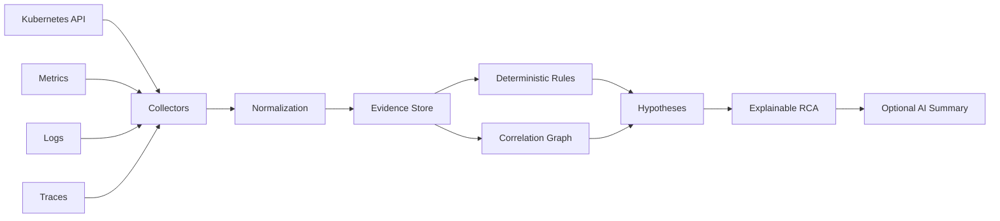

# Kubernetes RCA Engine

Evidence-driven **Root Cause Analysis for Kubernetes incidents**.

The project is designed around a simple principle: **collect deterministic evidence first, infer second**. AI can help summarize or rank hypotheses, but the diagnostic record should remain inspectable by an engineer.

## Why this exists

Kubernetes incidents rarely expose one clean signal. A production failure may involve pod state, kubelet events, resource pressure, application logs, metrics, traces and dependency behavior at the same time.

The goal of this project is to turn those signals into a structured incident timeline and a ranked set of evidence-backed findings.

## Current v0.1

The first implementation provides a small deterministic rules engine that analyzes normalized incident JSON and recognizes common Kubernetes failure patterns including:

- pod eviction caused by ephemeral-storage pressure;
- OOMKilled containers;
- CrashLoopBackOff symptoms.

It is intentionally dependency-light so that the correlation model can evolve independently from collectors.

## Quick start

```bash
go test ./...
go run ./cmd/krca analyze examples/evicted-ephemeral-storage.json
```

## Architecture



See [docs/architecture.md](docs/architecture.md) for the target architecture.

## Design principles

- **Evidence first:** every finding must point to observable signals.
- **Explainability:** confidence is never a substitute for evidence.
- **Symptom vs. cause:** a CrashLoopBackOff is a state, not automatically the root cause.
- **No production mutation:** analysis should default to read-only access.
- **Progressive enrichment:** metrics, logs and traces enrich Kubernetes-native evidence.
- **AI is optional:** deterministic diagnostics remain useful without an LLM.

## Example output

```json
{
  "cause": "Node ephemeral storage pressure",
  "confidence": 0.98,
  "evidence": [
    "Pod was evicted",
    "Eviction message mentions ephemeral-storage"
  ]
}
```

## Roadmap

- Kubernetes API collector using client-go
- event and owner-chain correlation
- node pressure analysis
- restart / termination-state analysis
- Prometheus evidence provider
- Loki and Tempo evidence providers
- incident timeline
- dependency and topology graph
- confidence calibration
- explainable AI summaries
- Helm deployment

## Safety

Use synthetic or sanitized data in examples. Never commit kubeconfigs, tokens, production logs containing customer data or cloud credentials.

## License

MIT
