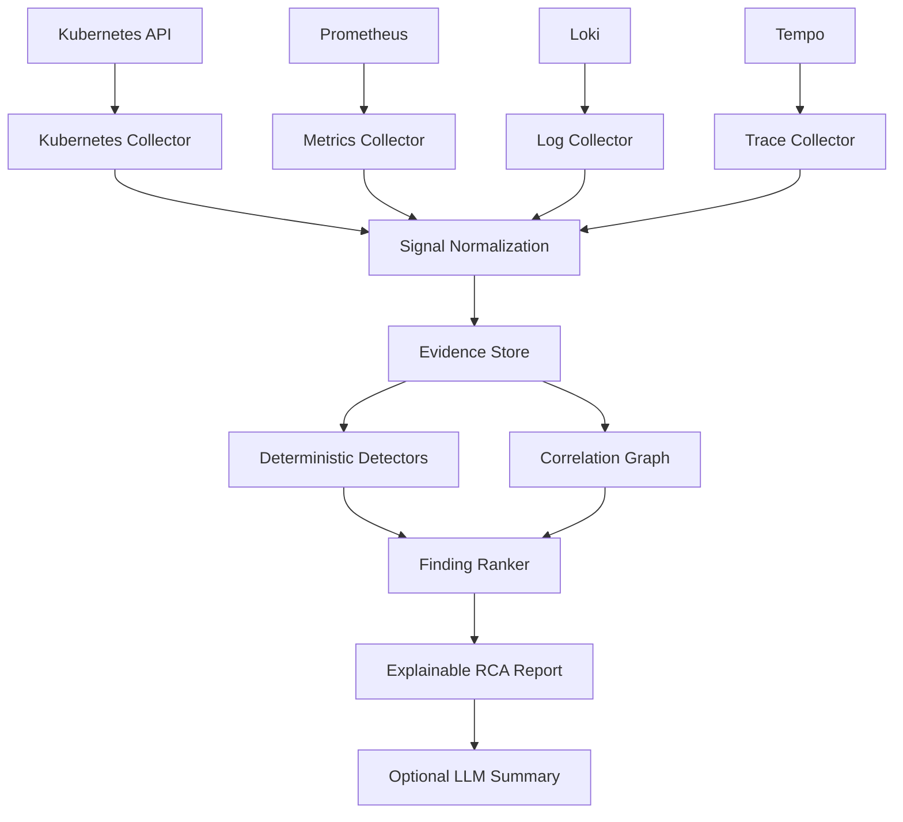

# Architecture

## Target data flow

## Boundaries

Collectors are read-only adapters. Normalization converts provider-specific payloads into a small internal model while retaining links to raw evidence.

Deterministic detectors encode high-confidence signatures. The correlation graph models workload, pod, container, node, service and dependency relationships.

The optional AI layer may summarize findings or suggest investigation paths, but must not invent evidence or mutate the cluster.
